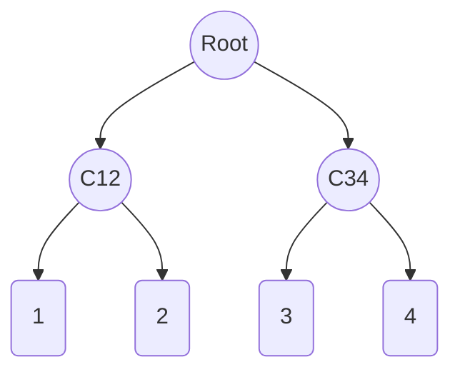

# Merkle Forest

## Abstract


## Motivation

Binary Increamental Merkle Tree(MT), With Special Level(Gurantee), is generally used as Group, which contatins identity commitments of group members(Tree leaf).

ZK using merkle path to prove the group membership, so the circuit size is related(linear) to Group Gurantee. 

Server issues exist for the single MT Group:
    1. group size is defined when create,   not support infinicate group.
    2. prover time growth (linear??) with Gurantee.
    3. onchain gas cost increase(linearly) for group operation(insert..)
    4. concurrency competition issue when multi user join the single group
        (1) reorder tx by relay, not native

## Overview
Philosoph is trade-off
    1. Privacy
    2. Efficent (ZK-Prover/On-chain)

We Propose Merkle Forest, using sharding of multi smaller group, instead of single huge group.
    1. decouple the circuit size from Gurantee.
    2. Group Size = 2^Gurantee = 2^H * 2^(G - H) = 2^H * K, K = 2^(G-H)




## Specification

### Create Group
create_eas

    depth 20 -> 10, tune.

increamental MT 
sparse MT

### Membership Prove
contain


### Join Group
append

    Dynamic Growth

Join, L-> R
    Hashed :  less shard expose , auto reorgnize.  re-blance. (tree split, no 2 different group)

### Leave Group(optional)

Privacy/Public Leavy

### Composable/CP-Snark(optional)
CP-SNARK and -> or ? 


 ## Reference Implementation
 TODO


# Setup
```shell
nvm use lts/hydrogen
npm install
npx hardhat run scripts/smt.ts
```

# Gas


# TODO
