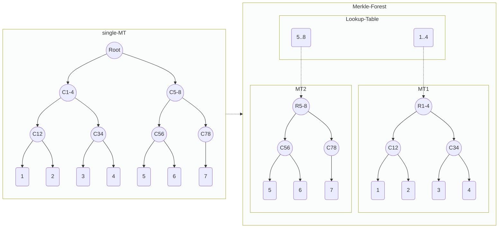

[TOC]


# Merkle Forest : Scalable Group Membership for ZK

## Abstract

Scalable Group Membership for ZK.

## Motivation

Binary Increamental Merkle Tree, With Fixed-size Depth(Gurantee), is generally used as Group. The navitve way to prove group membership, is verify merkle path in zk-cirucit, which means circuit is coupled with the tree depth. 

obviously, the exist circuit cannot be reused if user want a higher Gurantee.

Suppose the below sceniors:
1. User have a group of grantee 10, and it's almost full. user want to enlarge the group, but have to create a new group, and ask member to rejoin.
2. User want to create a group, but can't decide the gurantee yet, it will depand on how the bussiness going. Becouse of above 1, the only chocie is choose the maxium possible gurantee. even at the beginning, when the member small size, still have to generate full merkle path proof, result in non-efficent cost for both prover and on-chain verify.

so we can get a conclusion : fixed-size/static merkle tree can not meet the variety/dynamic user demands for group memebership.

Here We propose "Merkle Forest", to provide scalable group membership.
The Basic idea is "Combine multiple reuseable merkle tree" as the group.


the decrease of privacy is acceptable in practicial case. 

also some other advantage:
1. heavy trust setup for zkey (TODO : data, depth-20 need 2 hours on macbook pro). very big zkey file, become experience if user have to download for proof generate local.
2. inifinte group
3. build circuit themself.

more important is , Merkle tree itself not scalable, there is no way to enlarge exist group(new circuit for new MT),  such as infinite group demands.

ZK using merkle path to prove the group membership, so the circuit size is related(linear) to Group Gurantee. 

Server issues exist for the single MT Group:
* 1. group size is defined when create,   not support infinicate group.
* 2. prover time growth (linear??) with Gurantee.
* 3. onchain gas cost increase(linearly) for group operation(insert..)
* 4. concurrency competition issue when multi user join the single group
    (1) reorder tx by relay, not native

decouple , only 1 trust setup, scalable.

## Specification

### Definitions

* [identity](https://semaphore.appliedzkp.org/docs/guides/identities)
* group
* eas
* Loopup Table
* gurantee

### Framework
Philosoph is trade-off
    1. Privacy
    2. Efficent (ZK-Prover/On-chain)

We Propose Merkle Forest, using sharding of multi smaller group, instead of single huge group.
    1. decouple the circuit size from Gurantee.
    2. Group Size = 2^Gurantee = 2^H * 2^(G - H) = 2^H * K, K = 2^(G-H)




### Create Group  

```shell
    function new_eas(
        uint tree_depth,
        uint gurantee,
        uint zeroValue)
```

underline
* increamental MT 
* sparse MT

### Join Group

```shell
    function insert(
        uint256 groupId,
        uint256 identity)
```

Group Growth Strategy
* Dynamic Growth

* Sequencial
* Random
    Hashed :  less shard expose , auto reorgnize.  re-blance. (tree split, no 2 different group)

### Membership Prove

```shell
    function contains(
        uint256 groupId,
        uint256 identity,
        uint256[] calldata proofSiblings,
        uint8[] calldata proofPathIndices)
```

cost reduce
* prover cost
* gas cost


### Leave Group(optional)

```shell
    function remove(
        uint256 groupId,
        uint256 identity,
        uint256[] calldata proofSiblings,
        uint8[] calldata proofPathIndices)
```


* Privacy Leave
* Public Leave

### Composable/CP-Snark(optional)

CP-SNARK and -> or ? 


 ## [Reference Implementation](./contracts/SMT/smt.sol)

Fully compatible with Semaphore Interface, minor changes for implement eas.

## migrate exist group

exist group as 1 MT of the MT Forest.