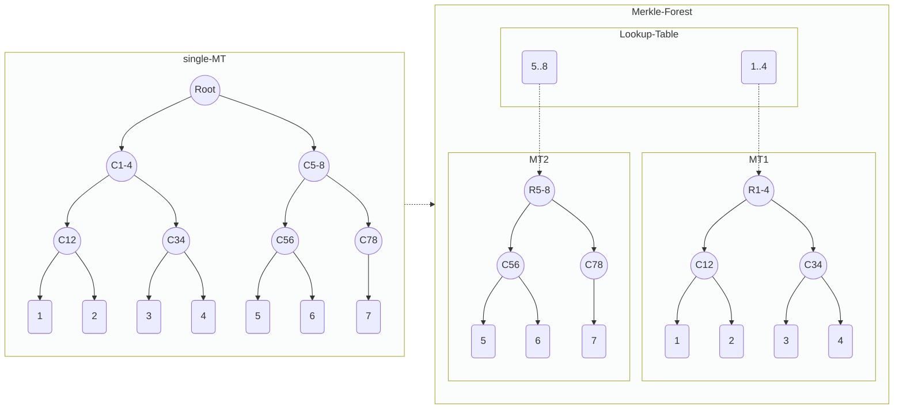

# Merkle Forest : ZK-friendly Elastic Group

## Abstract

## Background
[Semaphore](https://semaphore.appliedzkp.org/) is ZKP-powered protocol that allows users to:
* Prove their membership of a group 
* Send signals on a particular topic as a member of a group
without revealing their identity. At the core of this protocol lies the following [circuit](https://semaphore.appliedzkp.org/docs/technical-reference/circuits)


The first two private inputs, siblings and path indices, form a path in a Merkle tree, which represents the group whose leaves are the identity commitments of its members. The [Merkle tree verifier](https://github.com/semaphore-protocol/semaphore/blob/main/packages/circuits/tree.circom) outputs the root of the Merkle tree, while checking that the siblings and path indices describe a valid path from the identity commitment leaf to the root. Then the contract compares this root to the existing one. 

## Terminology
* [identity](https://semaphore.appliedzkp.org/docs/guides/identities): a triple consisting of a trapdoor, a nullifier and a commitment. The commitment is computed from the trapdoor and nullifier and is inserted as a leaf in the groups it belongs to.
* Group: In the Semaphore protocol, a Merkle tree. In our proposal, a Merkle forest. 
* Privacy/anonimity guarantee: a security parameter, the higher it is the lower the probability a member can be exposed in a group. In the Semaphore protocol above, it is the depth of the Merkle tree. For a guarantee $g$, the Merkle tree can store $2^g$ leaves, so the minimum exposure probability, achieved when the group reaches its maximum capacity, is $1/2^g$.
* Max group size. Max number of members a group can host. In the Semaphore protocol, this is the number of leaves the Merkle tree can store.
* EG: Elastic Group, whose size grows dynamically.

## Motivation
In the Semaphore example above, groups are modelled by binary incremental Merkle trees with fixed-size depth (privacy guarantee). The native way to prove group membership, as explained above, is to verify a Merkle path in a zk-circuit, which means this circuit depends on the tree depth. 

Suppose the below scenarios:
1. We have an almost full group. In order to enlarge the group, we would have to create a new group, and ask every member to rejoin.
2. We want to create a group, but can't decide the guarantee yet, as it will depand on how the bussiness is going. The only choice in this case is the maximum possible guarantee, otherwise we may need to create a new group as soon as we need to enlarge ours as explained in point 1. But then, even at the beginning, when there are few members, we still have to generate full Merkle path proofs, resulting in non-efficent cost for both the prover and the on-chain verifier.
3. [Optional] Users may join and leave a group frenquently, e.g. suppose 1 million users join and then leave. Even though the number of members at any time never exceeds the max group size, a group with a higher guarantee is still needed.

As a conclusion: fixed-size Merkle trees cannot meet the dynamic user demands for group memebership.

Another issue with the single Merkle tree model employed in the Semaphore protocol is how the max group size $K$ is a function of the privacy guarantee $g$, namely $K = 2^g$. If we have a group of size $m$, but only need a privacy guarantee of $g' < g$, using the parameter $g$ would result in larger proofs, slower proving time and a much costlier trusted setup.

## The solution: Merkle forest
We need to redefine groups with a new formula $G(g, n)$, where the guarantee $g$ has the same meaning as in the single Merkle tree case, i.e., a group member will have an exposure probability of $1/2^g$. The new parameter $n$ is the number of trees in the forest, so in this case the max group size is $n*2^g$.

With the new elastic group design. the original huge [Merkle tree membership circuit](https://github.com/semaphore-protocol/semaphore/blob/main/packages/circuits/tree.circom) can be reduced to
* a smaller Merkle tree membership circuit, which outputs a root
* find the output root in a look-up table

The Merkle forest described above will follow a left-to-right sequencial insertion of new members. To prevent the (total) loss of privacy the first member of a Merkle tree experiences until there are more members there as well, we propose the following design: the last Merkle tree in the forest will always have double size (so guarantee $+1$ w.r.t. the others). When this tree is full, we will fork it: the left side will be now a normally sized Merkle tree in the forest, while the right side will be joined by the new empty Merkle tree.


In the picture above, we see what happens when we insert the group member $L6$ to the Merkle forest, filling the last tree. The last tree is forked, the left side becoming a Merkle tree with guarantee 2 and the right side joining a new empty Merkle tree. Before the insertion, the lookup table of roots consisted of $R1$ and $R$ (but not $R2$ nor $R3$). After the insertion, the lookup table consists of $R1$, $R2$ and $R'$ (but not $R3$ not $R4$).

## Advantages
1. Elastic group : could be enlarged/downsized according to demands.
2. Possibly inifinte group.
3. Smaller Merkle proof circuits, faster prover.
4. Lighter trusted setup for zkey. For reference, a guarantee 20 Semaphore TS takes 2 hours on a macbook pro and produces a very big zkey file. This is inconvenient if the user has to download it for local proof generation.
5. Reduced concurrency competition when several users join a single group.

## Specification

### Semaphore Compatible

"Merkle Forest" is based on the Merkle tree membership circuit, which means no circuit changes are needed, the existing Semaphore circuit and corresponding sdk still work.

An onchain lookup table is introduced to map members to the corresponding Merkle tree.




### Create Elastic Group  

```shell
    function createGroup(
        uint guarantee,
        uint number_of_trees,
        uint zeroValue)
```

Creates a new elastic group, with user-provided anonymity guarantee and number of trees. For example, if the user sets the anonymity guarantee to be 10 and the number of trees size to be 4, then each Merkle tree in this forest has $2^{10} = 1024$ members, which means this EAS has 1/1024 anonymity. This EG can have maximum $2^{10}*4 = 4096$ leaves.

dynamic growth

underline
* increamental MT 
* sparse MT

### Join Group

```shell
    function insert(
        uint256 groupId,
        uint256 identity)
```

Group Growth Strategy
* Dynamic Growth

As the analysis before, in case the member expose when merkle tree is almost empty, we using a double-split strategy. the last tree will only be full when reach double grantee limit, and split into 2 full grantee tree.

The problem is when split happens, will have to update lookup table for all the tree leafs, which may be limited by the blockchain gas limit.

For Ethereum, 1 tx gas limit could be 10000000, each uint256 storage cost 20000 gas, max support 500 uint256 update. suppose we using T bit for tree index, the maxium leaf will be 500 * 256 / T, the maxium tree depth could be
log(500 * 256 / T). Let's say T = 16, support up to 2^16 group, with depth 12. if T = 8, supprt up to 2^8 group, with depth 13.

maxium group size = (2^T) * (500 * 256 / T),  also need consider gurantee request.

* Sequencial
* Random
    Hashed :  less shard expose , auto reorgnize.  re-blance. (tree split, no 2 different group)

### Membership Prove

```shell
    function contains(
        uint256 groupId,
        uint256 identity,
        uint256[] calldata proofSiblings,
        uint8[] calldata proofPathIndices)
```

cost reduce
* prover cost
* gas cost


### Leave Group(optional)

```shell
    function remove(
        uint256 groupId,
        uint256 identity,
        uint256[] calldata proofSiblings,
        uint8[] calldata proofPathIndices)
```

* Privacy Leave
* Public Leave

### Group Gurantee Change

Elastic Group

```shell
    function enlargeGroup(uint groupId, uint size)
    function downsizeGroup(uint groupId, uint size)
```

Increase/decrease group guarantee, group admin operation.
Decrease only succeeds if the group's member number does not exceed the new max size.


### Migrate existing group

Migrate existing group as 1 MT of the MT Forest.

the problem is "migrate on chain may exceed blockchain gas limit"
also have the similar "gas limit" as analysis "insert group"

### Composable/CP-Snark(optional)

CP-SNARK and -> or ? 


 ## [Reference Implementation](./contracts/SMT/smt.sol)

Fully compatible with Semaphore Interface, minor changes for implement eas.

