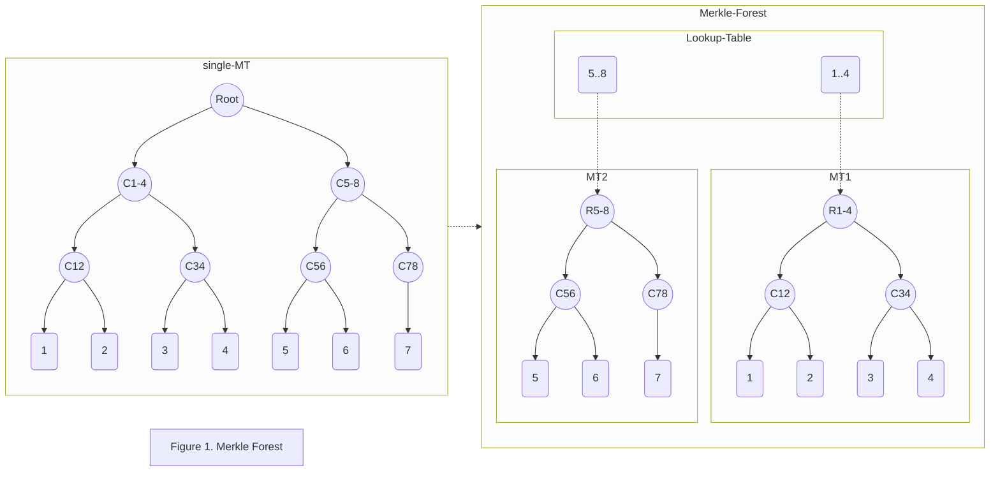
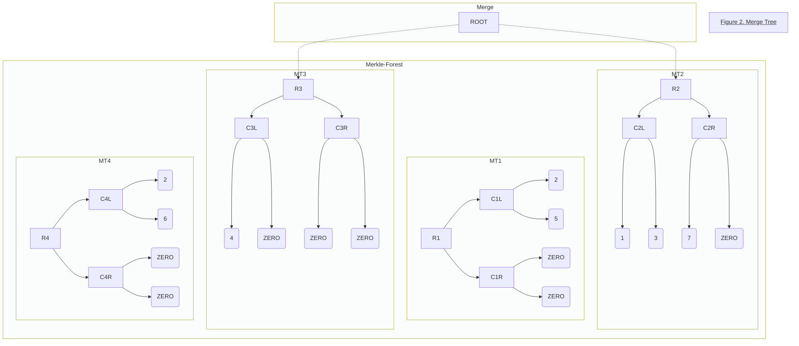
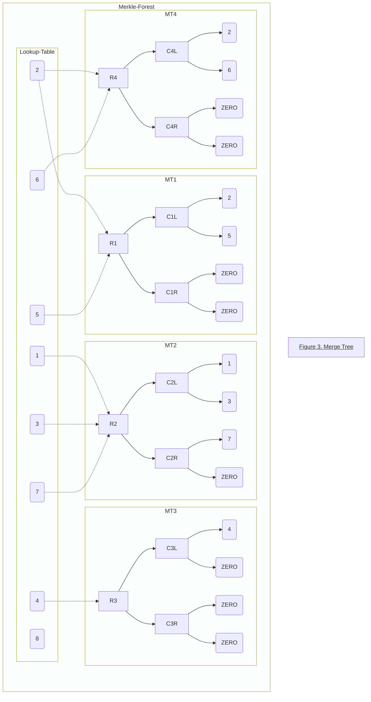

# ZK-Friendly Elastic Anonymous Group for Semaphore and More 

## Background
[Semaphore](https://semaphore.appliedzkp.org/) is ZKP-powered protocol that allows users to:
* Prove their membership of a group 
* Send signals on a particular topic as a member of a group
without revealing their identity. At the core of this protocol lies the following [circuit](https://semaphore.appliedzkp.org/docs/technical-reference/circuits)


The first two private inputs, siblings and path indices, form a path in a Merkle tree, which represents the group whose leaves are the identity commitments of its members. The [Merkle tree verifier](https://github.com/semaphore-protocol/semaphore/blob/main/packages/circuits/tree.circom) outputs the root of the Merkle tree, while checking that the siblings and path indices describe a valid path from the identity commitment leaf to the root. Then the contract compares this root to the existing one. 

## Terminology
* [identity](https://semaphore.appliedzkp.org/docs/guides/identities): a triple consisting of a trapdoor, a nullifier and a commitment. The commitment is computed from the trapdoor and nullifier and is inserted as a leaf in the groups it belongs to.
* Group: In the Semaphore protocol, a Merkle tree. In our proposal, a Merkle forest. 
* Privacy Guarantee: a security parameter, the higher it is the lower the probability a member can be exposed in a group. In the Semaphore protocol above, it is the depth of the Merkle tree. For a guarantee $g$, the Merkle tree can store $2^g$ leaves, so the minimum exposure probability, achieved when the group reaches its maximum capacity, is $1/2^g$.
* Max group size. Max number of members a group can host. In the Semaphore protocol, this is the number of leaves the Merkle tree can store.
* EG: Elastic Group, whose size grows dynamically.

## Motivation
In the Semaphore example above, groups are modelled by binary incremental Merkle trees with fixed-size depth (privacy guarantee). The native way to prove group membership, as explained above, is to verify a Merkle path in a zk-circuit, which means this circuit depends on the tree depth. 

Suppose the below scenarios:
1. We have an almost full group. In order to enlarge the group, we would have to create a new group, and ask every member to rejoin.
2. We want to create a group, but can't decide the guarantee yet, as it will depand on how the bussiness is going. The only choice in this case is the maximum possible guarantee, otherwise we may need to create a new group as soon as we need to enlarge ours as explained in point 1. But then, even at the beginning, when there are few members, we still have to generate full Merkle path proofs, resulting in non-efficent cost for both the prover and the on-chain verifier.
3. [Optional] Users may join and leave a group frenquently, e.g. suppose 1 million users join and then leave. Even though the number of members at any time never exceeds the max group size, a group with a higher guarantee is still needed.

As a conclusion: fixed-size Merkle trees cannot meet the dynamic user demands for group memebership.


## The solution: Elastic Anonymous Group using Merkle Forest

### Elastic Size 

We define elastic anonymous groups (EAG) with $G(g)$, where $g$ is the depth of each merkle tree and $2^g$ is the default privacy guarantee. Comparing with a fixed size merkle tree, EAG has a default privacy guarantee but has no size limit. 

> Note: user can choose to boost up privacy guarantee using the elastic privacy guarantee technique introduced in [Next section](#elastic-privacy-guarantee)



With the new elastic group design. the original huge [Merkle tree membership circuit](https://github.com/semaphore-protocol/semaphore/blob/main/packages/circuits/tree.circom) can be reduced to
* a smaller Merkle tree membership circuit, which out=puts a root
* find the output root in a look-up table

### Elastic Privacy Guarantee

this actually provide "elastic gurantee", suppose the follow cases:
1. user provide the "treeId" of elastic group, and merkle proof of that tree, get a minium grantee.
2. user join a tree which have less leaves, which means it might loss privacy, then user could "merge" its original tree and another full-size tree to be a new tree, and provide membership in the new tree. As an example in Figure 2, if member 4 want to prove membership with privacy grantee 2, then it can merge serveal trees to make the total members is more than 2**2 in new tree, here merge tree 2 and 3, and provide the merkle proof of new tree.  
3. user might want higher privacy gurantee, by "merge" all the trees. user decide the gurantee they want. Figure 2 given an example of merge 4 trees in group.




The "merge" demands varies between different user case, suppose two kinds of privacy vote case
1. privacy vote only after all user have joined and group freezed.
2. privacy vote happens simultanously as new member join the group.

In the 2nd user case, concurrency competion could happen. for example, when user A vote and user B join the same group at the same time, and the join 1st complete modify merkle tree on-chain, while vote still using old merkle path, result in on-chain verify fail. It could possible be resolved by centralized cordinator, like relayer, in some specific user cases， but not all user case. A native methology is required for reduce concurency competion.

So here, we proposal a hash-based random-member-join strategy, that is, select a random group to join, in this way, simulatanously prove and join activity will most probably operate on different group, thus almost avoid concurrency competition. Figure 3 show an example of random-memeber-join merkle forest.




The random-member-join strategy require more "merge" for privacy-gruantee prove, because of each tree might be sparse in the number of leaves, and need caculate a list of trees to be merged.  it actually bring unneed burden of the 1st user case, who has no concurrency demands. We can simply apply a "sequential-member-join" strategy instead, for this case, Figure 1 give an example, member always join current tree until it's full. 

## Advantages
1. Elastic group : could be enlarged/downsized according to demands.
2. Possibly infinite group.
3. accurate fine-grained group size.
4. Smaller Merkle proof circuits, faster prover.
5. Lighter trusted setup for zkey. For reference, a guarantee 20 Semaphore TS takes 2 hours on a Macbook Pro and produces a very big zkey file. This is inconvenient if the user has to download it for local proof generation.
56. Reduced concurrency competition when several users join a single group.

## Specification

### Semaphore Compatible

"Merkle Forest" is based on the Merkle tree membership circuit, which means no circuit changes are needed, the existing Semaphore circuit and corresponding sdk still work.

An onchain lookup table is introduced to map members to the corresponding Merkle tree.


### Create Elastic Group  

```shell
    function createGroup(
        uint guarantee,
        uint number_of_trees,
        uint zeroValue)
```

Creates a new elastic group, with user-provided anonymity guarantee and number of trees. For example, if the user sets the anonymity guarantee to be 10 and the number of trees size to be 4, then each Merkle tree in this forest has $2^{10} = 1024$ members, which means this EAS has 1/1024 anonymity. This EG can have maximum $2^{10}*4 = 4096$ leaves.

We use an [incremental Merkle tree](https://github.com/privacy-scaling-explorations/zk-kit/tree/main/packages/incremental-merkle-tree) which is fully compatible with Semaphore.

### Join Group

```shell
    function insert(
        uint256 groupId,
        uint256 identity)
```

As explained in the analysis above, to prevent member exposure when their Merkle tree is almost empty, we use a double-split strategy. The last tree will only be full when it reaches a double guarantee limit, and then split into 2 full guarantee trees. The right tree after the splitting will be attached on the right to an empty Merkle tree, thus becoming the new double size Merkle tree in the forest.

### Membership Proof

```shell
    function contains(
        uint256 groupId,
        uint256 identity,
        uint256[] calldata proofSiblings,
        uint8[] calldata proofPathIndices)
```

The membership proof interface is exactly the same as Semaphore's, but with smaller Merkle proofs and faster prover time.

```shell
    function verifyProof(
        uint groupId,
        uint[] calldata treeIds,
        uint[8] calldata proof
    )
```

### Leave Group (optional)

```shell
    function remove(
        uint256 groupId,
        uint256 identity,
        uint256[] calldata proofSiblings,
        uint8[] calldata proofPathIndices)
```

Leave Group is exactly the same as Semaphore's.

### Group Guarantee Change

Elastic Group

```shell
    function enlargeGroup(uint groupId, uint size)
    function downsizeGroup(uint groupId, uint size)
```

Increase/decrease group guarantee, group admin operation.
Decrease only succeeds if the group's member number does not exceed the new max size.


### Migrate existing group

TODO : Migrate existing group as 1 MT of the MT Forest.

<!-- ### Composable/CP-Snark(optional)

CP-SNARK and -> or ?  -->


## Profile

benchmark for different depth semaphore group with macbook pro(intel) 2019
show that, circuit constraints growth linearly, so as to pk size and prove time.
while trust setup time/ptau size growth Exponentially, which will benefit more from elastic group design.

|Merkle Tree Depth|trust setup time |ptau size|constraints| pk size|prove time|
|  ----  | ----  | ----  | ----  | ----  | ----  |
|16|10 min|72M|9K|2.8M|5.5s|
|20|160 min|1.1G|12K|3.3M|6.5s|
|32|unfinished||18K|5.2M||

## [Reference Implementation](./contracts/SMT/smt.sol)

Fully compatible with Semaphore Interface, minor changes for implement eas.
