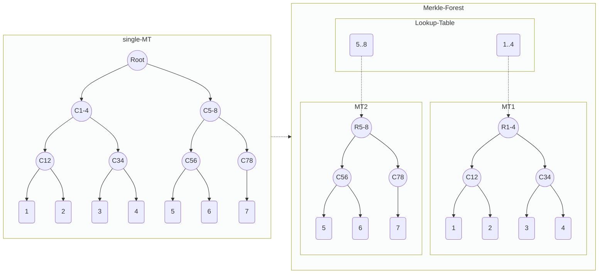

# Merkle Forest : ZK-friendly Elastic Group

## Abstract


## Motivation

Binary Increamental Merkle Tree, With Fixed-size Depth(Gurantee), is generally used as Group. The navitve way to prove group membership, is verify merkle path in zk-cirucit, which means circuit is coupled with the tree depth. 

obviously, the exist circuit cannot be reused if user want a higher Gurantee.

Suppose the below sceniors:
1. User have a group of grantee 10, and it's almost full. user want to enlarge the group, but have to create a new group, and ask member to rejoin.
2. User want to create a group, but can't decide the gurantee yet, it will depand on how the bussiness going. Becouse of above 1, the only chocie is choose the maxium possible gurantee. even at the beginning, when the member small size, still have to generate full merkle path proof, result in non-efficent cost for both prover and on-chain verify.
3. [Optional] User may join and leave group frenquently, suppose totolly 1 million join/leave, even though the total members at any time never exceed 1024, a group with grantee > 20 is still needed.

so we can get a conclusion : fixed-size merkle tree can not meet the variety/dynamic user demands for group memebership.

Let's return back to the 1st demand, and think more fine-graind about the "grantee", it can be defined as the probability of member can be exposed in group, suppose grantee=10, then the group size will be 2**10 = 1024, the memeber have 1/1024 probability been recorgnized. for grantee=20, the probability is ~1/1million.

Does user really need such a low probability, maybe yes for some case, maybe not neccearry for other case.
For the later case, user actually need
1. acceptable grantee, for privacy protect
2. max group size, which limit the join behaviour

So We need redefine Group Property with a new formula G(grantee, K), where grantee have the same meaning in merkle tree, while K describe the group size in a metric of merkle tree number, that is what we called "Merkle Forest".

With the new elastic group design. the original huge-MT prove can be reduced to
* small-MT prove
* find the MT for group member

and get many benefits :
1. elastic group : could be enlarge/downsize according to demands.
2. inifinte group
3. smaller/constant merkle proof circuit, faster prover.
4. lightweight/reusable trust setup for zkey (TODO : data, depth-20 need 2 hours on macbook pro). very big zkey file, become experience if user have to download for proof generate local.
5. onchain gas cost ??
6. reduce concurrency competition when multi user join the single group
    (1) [optional] reorder tx by relay, not native


## Definitions

* [identity](https://semaphore.appliedzkp.org/docs/guides/identities) : a big number on behalf of member
* Group : a group for member join, and prove the membership.
* Gurantee : group capability, support gurantee=10, group can have maxium 2^10 member to join
* Group Membership : prove member exist in group, usally by it's merkle path.
* EG : Elastic Group, whose size dynamic growth.

## Specification

### Semaphore Compatible

"Merkle Forest" is based on Merkle-Tree prove, which means no circuit change, the exist semaphore circuit and corresponding sdk still works.

A lookup table is introduced to mapping member to corresponding merkle tree.




### Create Group  

```shell
    function createGroup(
        uint gurantee,
        uint size,
        uint zeroValue)
```

creates a new EG, with user-provided anonymity guarantee, for example, if the user set the anonymity guarantee to be 10, then the shard size of this EAS is 2
10 = 1024, which means this EAS has 1/1024 anonymity.

Privacy Level : real gurantee.


if user don't give gurantee, infinite 

dynamic growth

underline
* increamental MT 
* sparse MT

### Join Group

```shell
    function insert(
        uint256 groupId,
        uint256 identity)
```

Group Growth Strategy
* Dynamic Growth

* Sequencial
* Random
    Hashed :  less shard expose , auto reorgnize.  re-blance. (tree split, no 2 different group)

### Membership Prove

```shell
    function contains(
        uint256 groupId,
        uint256 identity,
        uint256[] calldata proofSiblings,
        uint8[] calldata proofPathIndices)
```

cost reduce
* prover cost
* gas cost


### Leave Group(optional)

```shell
    function remove(
        uint256 groupId,
        uint256 identity,
        uint256[] calldata proofSiblings,
        uint8[] calldata proofPathIndices)
```


* Privacy Leave
* Public Leave

### Group Gurantee Change

Elastic Group

```shell
    function enlargeGroup(uint groupId, uint size)
    function downsizeGroup(uint groupId, uint size)
```

increase/decrese group gurantee, group admin operation.
decrese only success if group's member number not exceed the new gurantee.


### migrate exist group

exist group as 1 MT of the MT Forest.

problem is 

gas limit

### Composable/CP-Snark(optional)

CP-SNARK and -> or ? 


 ## [Reference Implementation](./contracts/SMT/smt.sol)

Fully compatible with Semaphore Interface, minor changes for implement eas.

